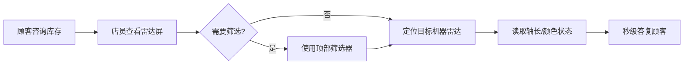
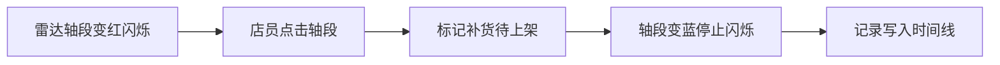
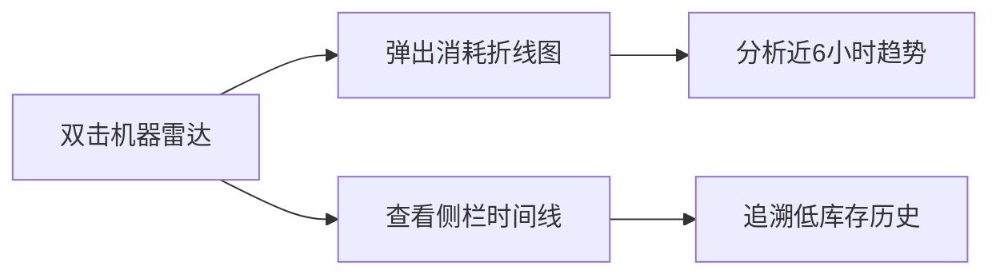

## 1. 产品概述

Pop Mart 抽盒机雷达屏监控系统，为上海静安大悦城快闪角店员提供 12 台抽盒机的实时库存可视化监控，将原本需要 90 秒的人工盘点变为秒级可视化响应，显著提升高峰时段顾客服务效率。

- **核心目标**：通过机器 × 系列双维雷达图，直观展示各机器各系列端盒剩余库存，快速响应顾客询问
- **目标用户**：快闪角店员、运营管理人员
- **使用场景**：高峰时段顾客咨询、低库存预警、补货标记、历史库存追溯

## 2. 核心功能

### 2.1 用户角色

| 角色 | 登录方式 | 核心权限 |
|------|----------|----------|
| 店员 | 本地应用直接访问 | 查看库存、标记补货、查看历史记录 |
| 管理员 | 本地应用直接访问 | 全部功能（同店员） |

### 2.2 功能模块

1. **雷达屏主界面**：12 台抽盒机雷达图阵列，每台机器独立雷达图展示 8 个系列库存
2. **顶部筛选器**：按机器编号、系列名称、是否含隐藏款多维度筛选
3. **低库存预警**：余量 ≤2 时轴段变红闪烁，点击标记补货后变蓝
4. **侧栏时间线**：历史低库存记录追溯，保留所有低库存事件
5. **消耗趋势弹窗**：双击雷达图查看单机器近 6 小时端盒消耗折线
6. **响应式适配**：iPad 横屏只读模式，窗口 resize 防抖 300ms

### 2.3 页面详情

| 页面名称 | 模块名称 | 功能描述 |
|----------|----------|----------|
| 主监控屏 | 雷达图阵列 | 12 台机器 × 8 系列双维可视化，轴长映射库存数量（0-12盒） |
| 主监控屏 | 筛选器 | 机器编号多选、系列名称多选、隐藏款开关，筛选后相关雷达高亮其余半透明 |
| 主监控屏 | 低库存预警 | 轴段余量 ≤2 变红闪烁，支持点击标记补货待上架 |
| 主监控屏 | 侧栏时间线 | 滑动展示历史低库存事件，包含机器、系列、时间、处理状态 |
| 消耗弹窗 | 折线图 | 展示单机器近 6 小时各系列端盒消耗趋势 |

## 3. 核心流程

### 3.1 库存查询流程

### 3.2 低库存处理流程

### 3.3 历史查询流程

## 4. 用户界面设计

### 4.1 设计风格

**潮玩科技感（Tech-Toy Aesthetic）**
- **主色调**：深空灰背景（#0a0a0f），霓虹粉（#ff2d78）、电光紫（#8b5cf6）、赛博蓝（#00d4ff）渐变
- **预警色**：危险红（#ff3b30）、补货蓝（#007aff）
- **字体**：显示字体使用 Space Grotesk（现代科技感），正文字体使用 Inter（清晰易读）
- **布局**：暗色模式卡片式布局，玻璃态（Glassmorphism）半透明效果
- **动效**：低库存脉冲闪烁动画、筛选过渡淡入淡出、hover 霓虹发光效果
- **图标**：线性图标配合霓虹发光，保持潮玩品牌的年轻活力

### 4.2 页面设计概览

| 页面名称 | 模块名称 | UI 元素 |
|----------|----------|----------|
| 主监控屏 | 雷达图阵列 | 3×4 网格布局，每格包含机器编号标签、雷达图、状态指示点 |
| 主监控屏 | 筛选器 | 顶部固定栏，胶囊式多选标签组，开关切换按钮 |
| 主监控屏 | 侧栏时间线 | 右侧可滑动抽屉，时间轴节点，彩色状态标签 |
| 消耗弹窗 | 折线图 | 模态弹窗，ECharts 折线图，多系列对比，关闭按钮 |

### 4.3 响应式

- **桌面端**：完整 3×4 雷达阵列 + 右侧常驻时间线
- **iPad 横屏**：只读模式，隐藏补货交互，3×4 阵列全屏展示
- **iPad 竖屏 / 平板**：2×6 阵列布局，时间线可收起
- **窗口 resize**：ECharts 图表统一防抖 300ms 后重绘

### 4.4 视觉细节

- **雷达图**：轴标签渐变色彩，低库存区域红色发光描边，补货区域蓝色描边
- **卡片**：深色玻璃态卡片，16px 圆角，细微边框发光
- **按钮**：胶囊形态，hover 时霓虹外发光，active 时内缩微动画
- **时间线**：左侧彩色时间节点，右侧事件描述，滑动时视差效果
- **背景**：深色渐变 + 细微网格纹理 + 霓虹光斑装饰
