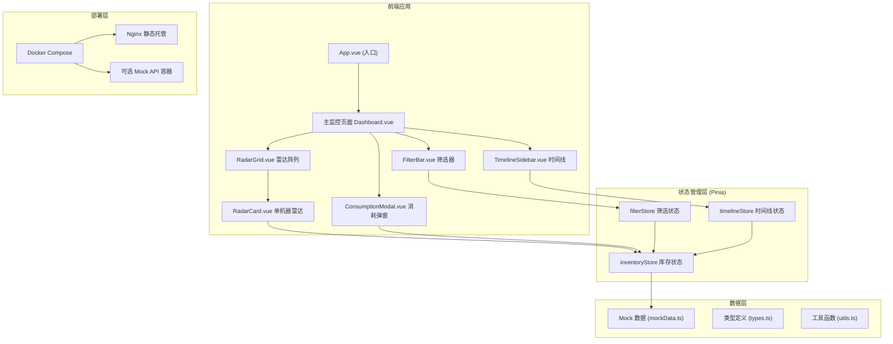

## 1. 架构设计



## 2. 技术描述

- **前端框架**: Vue 3.4 + TypeScript 5.4 + Vite 5.3
- **状态管理**: Pinia 2.1
- **图表库**: ECharts 5.5
- **路由**: Vue Router 4.3（单页面，可选）
- **CSS 方案**: Tailwind CSS 3.4 + 原生 CSS 变量
- **工具库**: Lodash-es (防抖等)
- **部署**: Docker Compose + Nginx Alpine
- **Mock**: 前端内置 Mock 数据 + 可选 Node.js Mock API 容器

## 3. 目录结构

```
tl-0064-1/
├── src/
│   ├── components/
│   │   ├── RadarGrid.vue          # 雷达图阵列容器
│   │   ├── RadarCard.vue          # 单机器雷达卡片
│   │   ├── FilterBar.vue          # 顶部筛选器
│   │   ├── TimelineSidebar.vue    # 侧栏时间线
│   │   └── ConsumptionModal.vue   # 消耗折线弹窗
│   ├── stores/
│   │   ├── filterStore.ts         # 筛选状态管理
│   │   ├── inventoryStore.ts      # 库存状态管理
│   │   └── timelineStore.ts       # 时间线状态管理
│   ├── types/
│   │   └── index.ts               # TypeScript 类型定义
│   ├── data/
│   │   └── mockData.ts            # Mock 数据
│   ├── composables/
│   │   ├── useECharts.ts          # ECharts 封装
│   │   ├── useResize.ts           # resize 防抖
│   │   └── useDevice.ts           # 设备检测
│   ├── utils/
│   │   └── index.ts               # 工具函数
│   ├── App.vue
│   ├── main.ts
│   └── style.css
├── nginx/
│   └── nginx.conf                 # Nginx 配置
├── docker-compose.yml             # Docker Compose 配置
├── Dockerfile                     # 前端构建 Dockerfile
├── vite.config.ts
├── tsconfig.json
├── tailwind.config.js
└── README.md
```

## 4. 数据模型

### 4.1 雷达数据 Schema

```typescript
// 系列定义
interface Series {
  id: string;
  name: string;           // Labubu, DIMOO, MOLLY, HIRONO, etc.
  color: string;          // 轴颜色
  hasHidden: boolean;     // 是否含隐藏款
}

// 单机器单系列库存
interface SeriesInventory {
  seriesId: string;
  stock: number;          // 0-12 端盒剩余数量
  isLowStock: boolean;    // stock <= 2
  isRestocked: boolean;   // 是否已标记补货
  lastUpdated: number;    // 时间戳
}

// 单机器完整数据
interface MachineInventory {
  machineId: number;      // 1-12
  series: SeriesInventory[];
  lastConsumption: ConsumptionPoint[];  // 近6小时消耗数据
}

// 消耗数据点
interface ConsumptionPoint {
  timestamp: number;
  seriesId: string;
  consumed: number;
}

// 时间线事件
interface TimelineEvent {
  id: string;
  machineId: number;
  seriesId: string;
  eventType: 'low_stock' | 'restocked';
  timestamp: number;
  stockLevel: number;
}

// 筛选状态
interface FilterState {
  selectedMachines: number[];    // 选中的机器编号，空数组为全部
  selectedSeries: string[];      // 选中的系列ID，空数组为全部
  hasHiddenOnly: boolean;        // 仅显示含隐藏款
}
```

### 4.2 8 个系列定义

| 序号 | 系列名称 | 英文名 | 颜色 | 隐藏款 |
|------|----------|--------|------|--------|
| 1 | Labubu | LABUBU | #ff2d78 | 是 |
| 2 | DIMOO | DIMOO | #8b5cf6 | 是 |
| 3 | MOLLY | MOLLY | #00d4ff | 是 |
| 4 | HIRONO | HIRONO | #f59e0b | 是 |
| 5 | SKULLPANDA | SKULLPANDA | #10b981 | 是 |
| 6 | CRYBABY | CRYBABY | #ec4899 | 否 |
| 7 | PUCKY | PUCKY | #6366f1 | 否 |
| 8 | Sweet Bean | SweetBean | #14b8a6 | 否 |

## 5. Pinia 模块划分

### 5.1 filterStore

```typescript
// 状态
selectedMachines: number[]
selectedSeries: string[]
hasHiddenOnly: boolean

// Getters
isMachineHighlighted: (machineId) => boolean
isSeriesHighlighted: (seriesId) => boolean
filteredMachines: MachineInventory[]

// Actions
toggleMachine(machineId)
toggleSeries(seriesId)
setHasHiddenOnly(value)
clearFilters()
```

### 5.2 inventoryStore

```typescript
// 状态
machines: MachineInventory[]
seriesList: Series[]

// Getters
getMachineById: (id) => MachineInventory
getSeriesById: (id) => Series
getSeriesStock: (machineId, seriesId) => number
hasLowStock: (machineId) => boolean

// Actions
markRestocked(machineId, seriesId)
updateStock(machineId, seriesId, newStock)
loadMockData()
```

### 5.3 timelineStore

```typescript
// 状态
events: TimelineEvent[]

// Getters
eventsByMachine: (machineId) => TimelineEvent[]
lowStockEvents: TimelineEvent[]
restockedEvents: TimelineEvent[]

// Actions
addEvent(event)
clearAll()
```

## 6. API 定义（可选 Mock API 容器）

| Method | Path | Description |
|--------|------|-------------|
| GET | /api/inventory | 获取所有机器库存 |
| GET | /api/inventory/:machineId | 获取单机器库存 |
| GET | /api/series | 获取系列列表 |
| GET | /api/consumption/:machineId | 获取近6小时消耗数据 |
| POST | /api/restock | 标记补货 |
| GET | /api/timeline | 获取时间线事件 |

## 7. 核心组件设计

### 7.1 RadarCard.vue

- Props: `machineId: number`, `highlighted: boolean`
- Emits: `restock(machineId, seriesId)`, `dblclick(machineId)`
- 功能：
  - 渲染单机器 8 轴雷达图
  - 轴长映射 stock (0-12)
  - stock ≤ 2 时轴段红色 + 闪烁动画
  - isRestocked 时轴段蓝色 + 停止闪烁
  - 点击轴段触发补货标记（非只读模式）
  - 双击触发消耗弹窗
  - 未高亮时 opacity: 0.3

### 7.2 FilterBar.vue

- Props: None
- State: 绑定 filterStore
- 功能：
  - 机器编号多选胶囊按钮 (1-12)
  - 系列名称多选胶囊按钮
  - "仅显示含隐藏款" 开关
  - "清除筛选" 按钮

### 7.3 TimelineSidebar.vue

- Props: None
- State: 绑定 timelineStore
- 功能：
  - 时间轴形式展示历史低库存/补货事件
  - 可滚动容器
  - 事件卡片：机器编号、系列名称、时间、状态标签

### 7.4 ConsumptionModal.vue

- Props: `machineId: number`, `visible: boolean`
- Emits: `close()`
- 功能：
  - ECharts 折线图展示近 6 小时各系列消耗
  - 多系列对比
  - 时间轴每 30 分钟一个数据点

## 8. 关键技术实现

### 8.1 ECharts 雷达图配置要点

```typescript
// 雷达图配置
const option = {
  radar: {
    indicator: seriesList.map(s => ({
      name: s.name,
      max: 12,
      color: s.color
    })),
    shape: 'polygon',
    splitNumber: 4,
    axisName: {
      color: '#fff',
      fontSize: 10
    },
    splitLine: { lineStyle: { color: 'rgba(255,255,255,0.1)' } },
    splitArea: { show: false }
  },
  series: [{
    type: 'radar',
    data: [{
      value: stockValues,
      name: '库存',
      areaStyle: {
        color: new echarts.graphic.RadialGradient(0.5, 0.5, 1, [
          { offset: 0, color: 'rgba(139,92,246,0.3)' },
          { offset: 1, color: 'rgba(255,45,120,0.1)' }
        ])
      },
      lineStyle: { width: 2, color: '#8b5cf6' },
      itemStyle: { color: '#ff2d78' }
    }]
  }]
}
```

### 8.2 低库存闪烁实现

```css
@keyframes pulse-red {
  0%, 100% { opacity: 1; }
  50% { opacity: 0.4; }
}

.low-stock {
  animation: pulse-red 1.2s ease-in-out infinite;
}
```

### 8.3 Resize 防抖实现

```typescript
// useResize.ts
export function useResize(chartRefs: Ref<echarts.ECharts[]>, delay = 300) {
  const debouncedResize = useDebounceFn(() => {
    chartRefs.value.forEach(chart => chart?.resize())
  }, delay)
  
  onMounted(() => window.addEventListener('resize', debouncedResize))
  onUnmounted(() => window.removeEventListener('resize', debouncedResize))
}
```

### 8.4 iPad 横屏检测

```typescript
// useDevice.ts
export function useDevice() {
  const isLandscape = ref(false)
  const isIPad = ref(false)
  const isReadOnly = computed(() => isIPad.value && isLandscape.value)
  
  const checkOrientation = () => {
    isIPad.value = /iPad/.test(navigator.userAgent) || 
                   (navigator.platform === 'MacIntel' && navigator.maxTouchPoints > 1)
    isLandscape.value = window.innerWidth > window.innerHeight
  }
  
  onMounted(() => {
    checkOrientation()
    window.addEventListener('orientationchange', checkOrientation)
    window.addEventListener('resize', checkOrientation)
  })
  
  return { isIPad, isLandscape, isReadOnly }
}
```

## 9. Docker 部署配置

### 9.1 docker-compose.yml

```yaml
version: '3.8'
services:
  web:
    build: .
    ports:
      - "8080:80"
    volumes:
      - ./nginx/nginx.conf:/etc/nginx/conf.d/default.conf
    restart: unless-stopped
    
  # 可选 Mock API 服务
  mock-api:
    image: node:18-alpine
    working_dir: /app
    volumes:
      - ./mock-server:/app
    command: sh -c "npm install && npm start"
    ports:
      - "3000:3000"
    profiles:
      - mock
```

### 9.2 Dockerfile

```dockerfile
FROM node:18-alpine AS builder
WORKDIR /app
COPY package*.json ./
RUN npm ci
COPY . .
RUN npm run build

FROM nginx:alpine
COPY --from=builder /app/dist /usr/share/nginx/html
COPY nginx/nginx.conf /etc/nginx/conf.d/default.conf
EXPOSE 80
CMD ["nginx", "-g", "daemon off;"]
```
